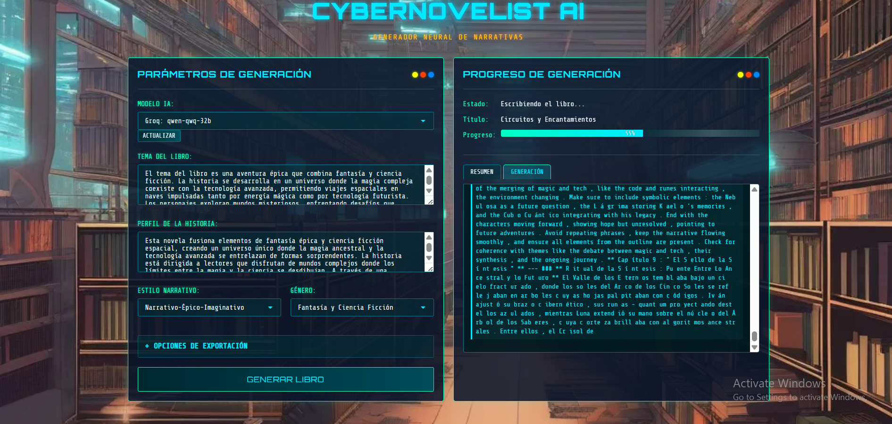

[](https://deepwiki.com/kroryan/Generador-de-libros-IA-cli)

## ✨ Introduction (WORKS ONLY IN SPANISH FOR NOW)

This project uses Large Language Models (LLMs) to generate complete fantasy novels with full transparency of the creative process.

> **⚠️ WARNING**: Early-stage project. Bugs and limitations may exist.

---

## 🆕 Recent Updates (October 2025)

* 🌟 **Improved real-time streaming**: Text is now streamed directly without fragmentation or modification.
* 🎨 **Visual separation of thoughts and responses**: Model thoughts are shown in magenta and responses in cyan.
* 🛠️ **Simplified logic**: Removal of unnecessary processing to ensure a smoother experience.
* 🚀 **Web interface optimization**: UI improvements for a more intuitive user experience.

## 🆕 Recent Updates (May 2025)

* 💾 **Savepoints system**: Robust implementation that prevents context loss during long text generation
* 🧠 **Improved context management**: Automatic context optimization to maintain coherence in long stories
* 💻 **Enhanced command mode**: You can now select models directly with `--model` and list available ones with `--list-models`
* 📝 **Inter-chapter summary system** to improve narrative coherence
* 🔄 **Improved narrative flow** with enriched context for continuity between sections
* 📊 **Professional document formatting** with optimized metadata, margins, and styles
* 📑 **Improved text organization** with semantic paragraph processing
* 🧠 **Multi-API model detection system**: Automatically detects models available in Ollama, OpenAI, DeepSeek, Groq, and custom providers
* 🔧 **Flexible configuration via `.env` file**: Fully customize all providers and models without touching the code
* 🎨 **Improved thought visualization**: Model thoughts are now displayed correctly in yellow and turn blue when finished
* 🖥️ **Fully redesigned cyberpunk web interface**

---

## 🚀 Key Features

* 🧠 Multi-API support (Ollama, OpenAI, DeepSeek, Groq, Anthropic)
* 📖 Full generation of narrative structures and characters
* 💾 Savepoints system to prevent context loss
* 🔄 Automatic recovery from model failures
* 📝 Summary system for narrative coherence
* 🎨 Cyberpunk interface with real-time visualization
* 📤 PDF/DOCX export with professional formatting
* ⚙️ Flexible configuration via `.env` file
* 🔍 Transparent process with model thoughts

---

## 🖥️ Interactive Demo



---

## ⚙️ Quick Setup

```bash
git clone https://github.com/kroryan/Generador-de-libros-IA-cli.git
cd Generador-de-libros-IA-cli
pip install -r requirements.txt

# Web mode (graphical interface)
python src/app.py --web  

# Console mode (recommended for better performance)
python src/app.py
```

For web mode, visit `http://localhost:5000` in your browser.

---

## 🐳 Docker Usage

You can run the application inside a Docker container for easier deployment.

1. Build the image (from the project root):

```powershell
docker build -t generador-libros:latest .
```

2. Run the container (mounting a `.env` file at the project root and the `docs` volume for outputs):

```powershell
docker run --rm -p 5000:5000 -v ${PWD}\.env:/app/.env:ro -v ${PWD}\docs:/app/docs generador-libros:latest
```

3. Use docker-compose (recommended for development):

```powershell
docker compose up --build
```

Notes:

* Do not include your keys/API keys inside the image. Use a `.env` file at the root and mount it as a volume (already configured in `docker-compose.yml`).
* The service exposes port `5000` by default.
* Output files will be written to the `docs/` folder on your host thanks to the volume.

---

## 💻 Command Line Usage

The program offers a powerful command-line interface with explicit model selection:

### 📋 Available Options

* **List available models**:

  ```bash
  python src/app.py --list-models
  ```

* **Generate a book with a specific model**:

  ```bash
  python src/app.py --model groq:llama3-8b-8192
  ```

* **Start the web interface with a preselected model**:

  ```bash
  python src/app.py --web 
  ```

### 🔧 Interaction with the `.env` file

* If you do not specify a model with `--model`, the program will use the `MODEL_TYPE` value from the `.env` file

* You can configure your `.env` file to set a default model:

  ```env
  MODEL_TYPE=groq
  GROQ_MODEL=llama3-8b-8192
  GROQ_API_KEY=your_api_key
  ```

* Model selection priority:

  1. Model specified with `--model`
  2. `MODEL_TYPE` value in `.env`
  3. Fallback to other configured providers

---

## 🧠 Savepoints System

The generator now includes a robust savepoints system that:

* 💾 **Creates periodic summaries** during content generation
* 🔄 **Maintains narrative coherence** even in very long texts
* 🛡️ **Prevents context loss** commonly occurring in LLMs
* 🚀 **Allows full book generation** without interruptions due to context limits
* 🔍 **Automatically optimizes context** to avoid model overload

This system works by creating strategic savepoints during writing, especially after long sections, allowing the model to effectively "remember" what happened before without having to keep all the text in context.

---

## 🛠️ Prompt Guide

### 🔍 Prompt Locations

| File                 | Class                 | Purpose             |
| -------------------- | --------------------- | ------------------- |
| `structure.py`       | `TitleChain`          | Book title          |
| `structure.py`       | `FrameworkChain`      | Narrative framework |
| `structure.py`       | `ChaptersChain`       | Chapter structure   |
| `ideas.py`           | `IdeasChain`          | Idea development    |
| `writing.py`         | `WriterChain`         | Narrative writing   |
| `chapter_summary.py` | `ChapterSummaryChain` | Chapter summaries   |

### 📝 Prompt Customization

1. Edit the corresponding file
2. Look for `PROMPT_TEMPLATE`
3. Modify it while keeping the `{variables}` placeholders

**Example for poetic style** (`writing.py`):

```python
PROMPT_TEMPLATE = """
You are a fantasy poet and writer in English.
Use metaphorical language and vivid descriptions.
...
"""
```

---

## 🌐 Supported Providers

| Provider       | Example Models            | Requirements      |
| -------------- | ------------------------- | ----------------- |
| Ollama (Local) | llama3, mistral, phi3     | Ollama Server     |
| OpenAI         | GPT-4, GPT-3.5            | API Key           |
| Groq           | Llama3, Mixtral-8x7b      | API Key           |
| DeepSeek       | DeepSeek-Chat             | API Key           |
| Anthropic      | Claude-3                  | API Key + library |
| Custom         | Any OpenAI-compatible API | `.env` config     |

---

## ⚙️ Full `.env` Configuration

```env
# Default model configuration
MODEL_TYPE=ollama
SELECTED_MODEL=ollama:llama3

# Ollama (local)
OLLAMA_MODEL=llama3
OLLAMA_API_BASE=http://localhost:11434

# OpenAI
OPENAI_API_KEY=your_key_here
OPENAI_MODEL=gpt-4
OPENAI_API_BASE=  # Optional, for compatible APIs

# Groq
GROQ_API_KEY=your_key_here
GROQ_MODEL=llama3-8b-8192
GROQ_API_BASE=https://api.groq.com/openai/v1

# DeepSeek
DEEPSEEK_API_KEY=your_key_here
DEEPSEEK_MODEL=deepseek-chat
DEEPSEEK_API_BASE=https://api.deepseek.com

# Anthropic
ANTHROPIC_API_KEY=your_key_here
ANTHROPIC_MODEL=claude-3-opus

# Custom providers (OpenAI-compatible)
CUSTOM_API_KEY=your_key_here
CUSTOM_API_BASE=https://your-custom-api.com/v1
CUSTOM_MODEL=your-custom-model
```

---

## 🚧 Generation Process

1. **Structure (20%)**: Title and narrative framework
2. **Ideas (40%)**: Chapter and plot development
3. **Writing (85%)**: Detailed narrative with savepoint management
4. **Publishing (100%)**: PDF/DOCX export with professional formatting

---

## 🚧 Future Development

* ✅ Savepoints system
* ✅ Advanced parameter support
* ✅ Integration with more providers
* ⏳ Image generation for scene illustration
* ⏳ Advanced personality tuning
* ⏳ Persistent memory implementation

---

## 📱 Contact

If for any reason you want to contact me, you can do so by joining this [Discord](https://discord.gg/TTmrXaeXM8) — my name on the server is Allen.
